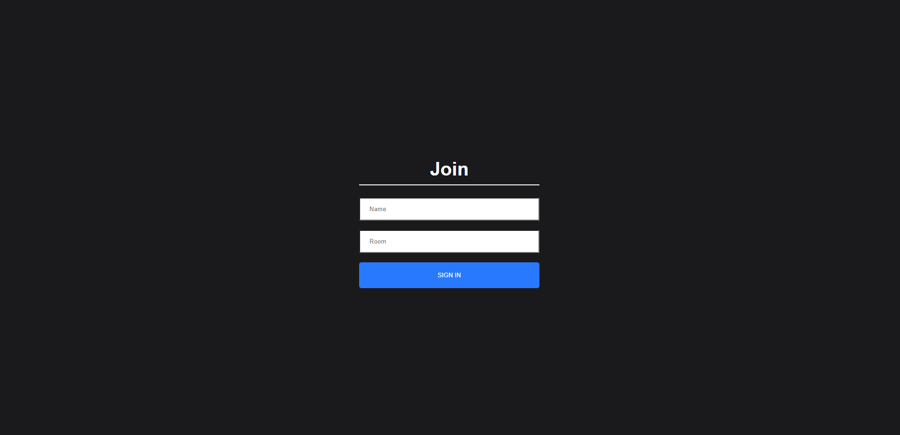
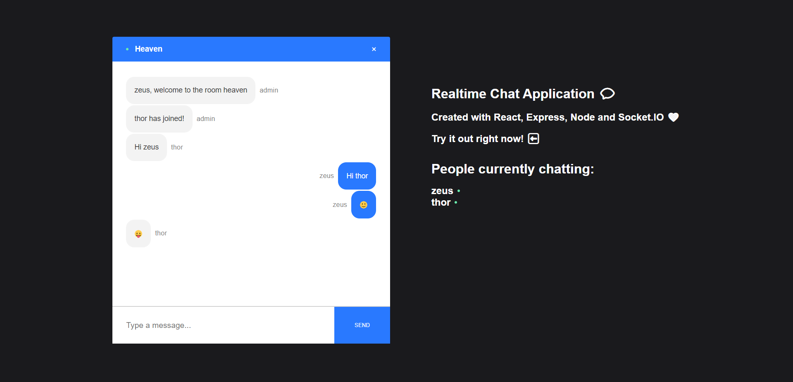
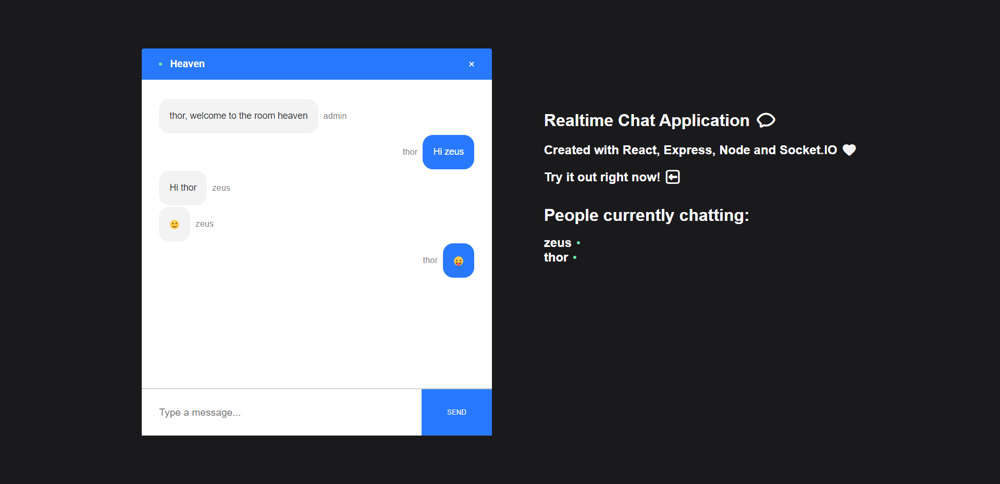

Realtime Chat Application
=========================  

[Live Website](https://utkarsh-react-chat-app.netlify.app/)  

This Realtime Chat Application is using ReactJS on the front end and NodeJS + Socket.io web socket library on the back end to send and receive messages in real-time.  

  

  

  
